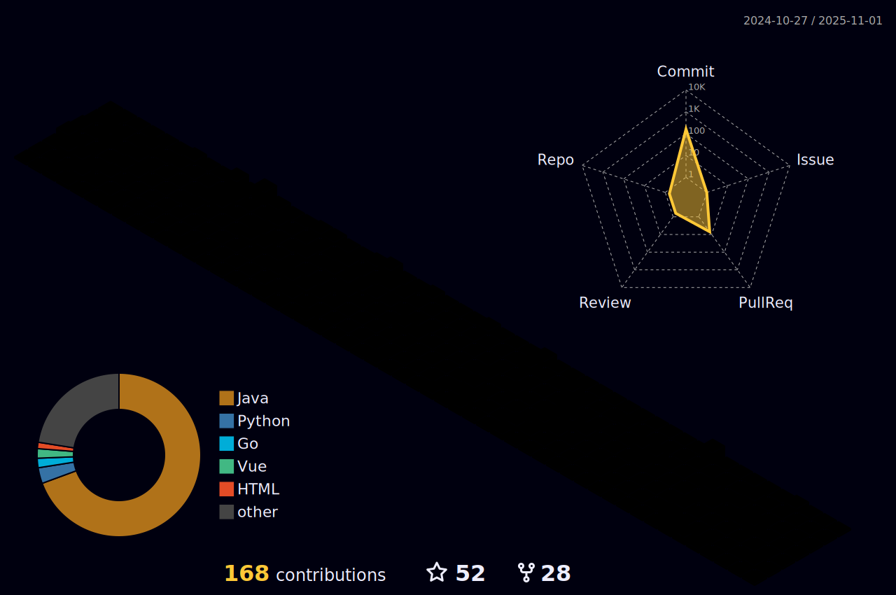

### Hi there 👋

- 🌱 I have been working as a Java Developer for a few years.
- Advanced: NaN 
- Intermediate: Java
- Novice: C, Kotlin
- Awareness: Go

- 📫 lwohvye@outlook.com

🔭

  

⚡
<!--
**lWoHvYe/lWoHvYe** is a ✨ _special_ ✨ repository because its `README.md` (this file) appears on your GitHub profile.

Here are some ideas to get you started:

- 🔭 I’m currently working on ...
- 🌱 I’m currently learning ...
- 👯 I’m looking to collaborate on ...
- 🤔 I’m looking for help with ...
- 💬 Ask me about ...
- 📫 How to reach me: ...
- 😄 Pronouns: ...
- ⚡ Fun fact: ...

- 了解 (Awareness)：知道该语言，但在没有帮助的情况下无法编写简单的程序

- 新手 (Novice)：可以用该语言完成简单的编程项目，可能需要帮助

- 中级 (Intermediate)：可以在一些帮助下完成重要的编程项目

- 高级 (Advanced)：可以在没有帮助的情况下完成重要的编程项目

- 专家 (Expert)：可以提供指导、故障排除和回答其他工程师与该语言相关的问题

-->
